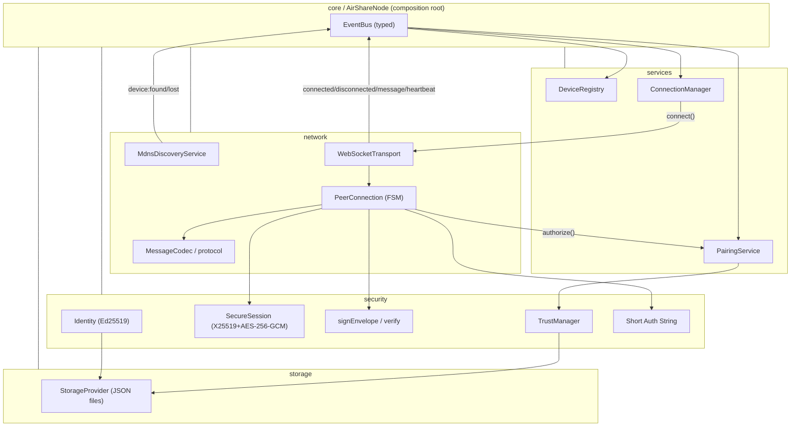
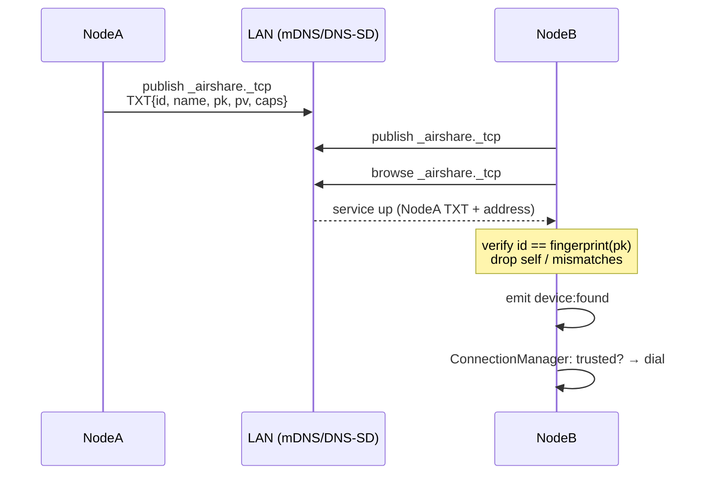
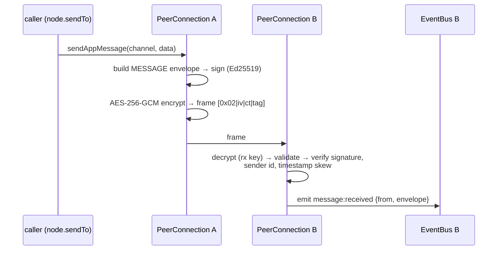
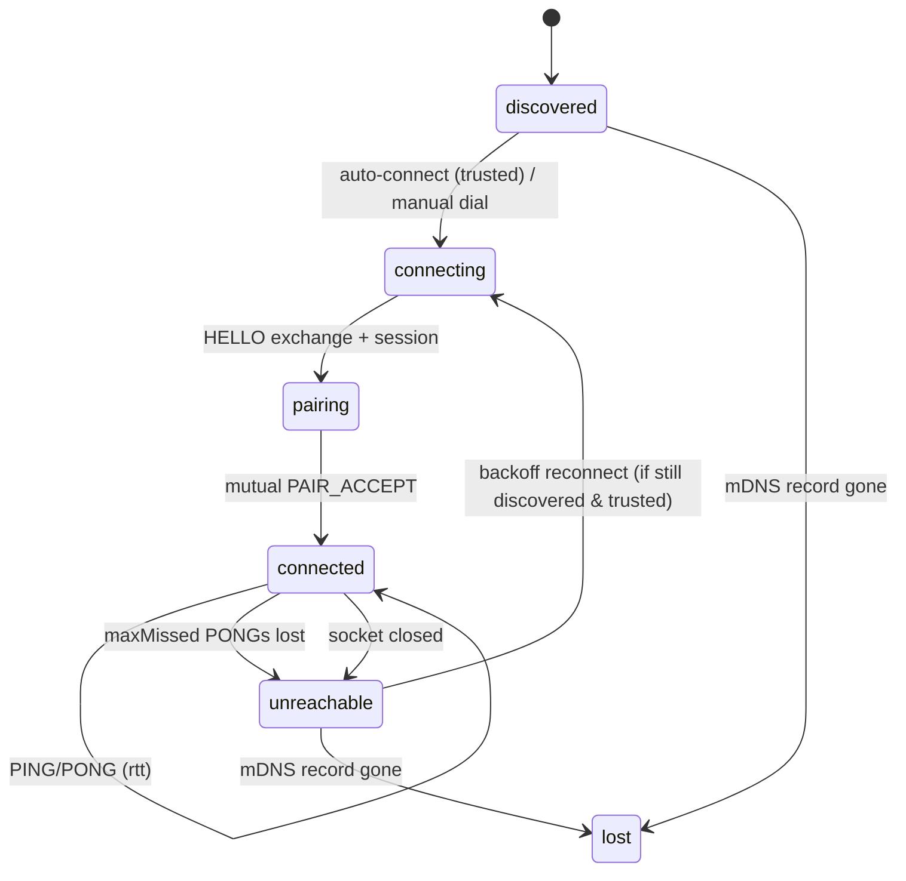

# Air Share — Architecture (Phase 1)

This document contains the architecture diagram, data-flow and sequence diagrams,
and the wire-protocol specification. Diagrams use Mermaid.

---

## 1. Module architecture



**Key rule:** modules never import each other's concrete implementations to
communicate at runtime — they publish/subscribe on the `EventBus`. The only place
concrete wiring happens is `AirShareNode` (Dependency Injection root).

---

## 2. Discovery data flow



The TXT record is only a hint. Nothing is trusted from discovery — identity is
re-proven cryptographically during the handshake.

---

## 3. Handshake + pairing (the security-critical path)

```mermaid
sequenceDiagram
  participant A as NodeA (initiator)
  participant B as NodeB (responder)

  A->>B: HELLO {pk_A, ephA, nonceA} signed by A
  Note over B: check id_A == fingerprint(pk_A)<br/>verify signature with pk_A
  B->>A: HELLO_ACK {pk_B, ephB, nonceB} signed by B
  Note over A: check id_B == fingerprint(pk_B)<br/>verify signature with pk_B
  Note over A,B: both derive AES-256-GCM keys via X25519 ECDH<br/>(ephA, ephB) → HKDF → tx/rx keys
  Note over A,B: both compute SAS = f(ephA, ephB)

  par each side independently
    A->>A: authorize(id_B, SAS)
    B->>B: authorize(id_A, SAS)
  end

  Note over A,B: trusted → auto-approve; unknown → user confirms SAS
  A->>B: PAIR_ACCEPT (encrypted, signed)
  B->>A: PAIR_ACCEPT (encrypted, signed)
  Note over A,B: connected once BOTH approved locally AND remotely
  A->>B: (persist trust) heartbeats begin
```

- **Mutual consent:** a link only reaches `connected` when each side has both
  approved locally *and* received the peer's `PAIR_ACCEPT`. Either side may send
  `PAIR_REJECT` to abort.
- **Anti-MITM:** the SAS is derived from both ephemeral keys, so a
  man-in-the-middle who substitutes keys produces a *different* code on each
  side; users comparing the code detect the attack.
- **Anti-spoof:** `deviceId == SHA-256(publicKey)` is enforced, and the HELLO is
  signed by that key — a peer cannot claim an id it has no private key for.

---

## 4. Application message flow



Every application frame is both **encrypted** (AEAD, confidentiality+integrity)
and **signed** (per-message origin authenticity). Replays outside the configured
clock-skew window are dropped.

---

## 5. Heartbeat & reconnection



- **Heartbeat:** every `intervalMs` a `PING` is sent; a `PONG` must arrive within
  `timeoutMs`. `maxMissed` consecutive misses ⇒ `unreachable` + close.
- **Reconnection:** `ConnectionManager` redials trusted, still-discovered peers
  with capped exponential backoff + jitter (`computeBackoff`), surviving Wi-Fi
  blips. It gives up if the device becomes `lost` or after `maxAttempts`.

---

## 6. Wire protocol specification

### 6.1 Frame

```
+--------+-----------------------------------------------+
| 1 byte |                    body                        |
+--------+-----------------------------------------------+
  0x01 = plaintext  → body = UTF-8 JSON envelope (handshake only)
  0x02 = encrypted  → body = [12B IV][ciphertext][16B GCM tag]
                              plaintext(ciphertext) = UTF-8 JSON envelope
```

### 6.2 Envelope

```jsonc
{
  "version":   1,
  "messageId": "uuid-v4",
  "timestamp": 1730000000000,   // epoch ms; skew-checked
  "sender":    "<deviceId>",    // = base64url(SHA-256(publicKey))
  "receiver":  "<deviceId>|*",  // "*" only pre-identification
  "type":      "PING|PONG|HELLO|HELLO_ACK|PAIR|PAIR_ACCEPT|PAIR_REJECT|MESSAGE|TRANSFER_START|TRANSFER_END|ERROR",
  "payload":   { /* type-specific */ },
  "signature": "base64url(Ed25519 over canonical envelope w/o signature)"
}
```

The signature covers a **canonical** serialization (recursively key-sorted JSON,
`undefined` omitted) so it verifies identically across platforms regardless of
key ordering.

### 6.3 Message types (Phase 1)

| Type | Direction | Encrypted | Purpose |
| --- | --- | --- | --- |
| `HELLO` / `HELLO_ACK` | dialer ↔ listener | no | identity + ephemeral key exchange |
| `PAIR_ACCEPT` / `PAIR_REJECT` | both | yes | mutual pairing consent |
| `PING` / `PONG` | both | yes | heartbeat / RTT |
| `MESSAGE` | both | yes | application data on a named channel |
| `TRANSFER_START` / `TRANSFER_END` | both | yes | reserved for Phase 2 file transfer |
| `ERROR` | both | yes | structured error (`ErrorCode`) |

Adding a type = one enum member + one payload interface in
[`src/types/messages.ts`](../src/types/messages.ts); the discriminated union keeps
every handler exhaustive at compile time.
