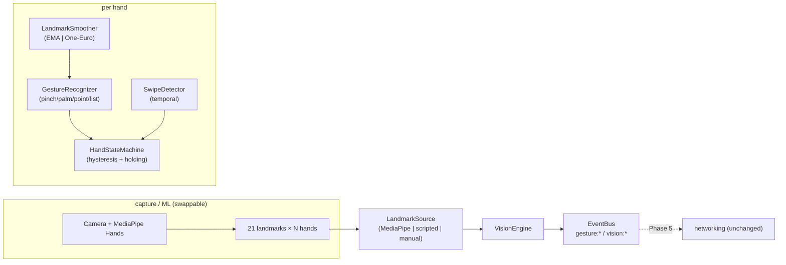

# Air Share — Phase 2: Vision & Gesture Engine

Phase 2 adds the **perception layer** — the "eyes" of Air Share. It turns hand
landmarks into stable, high-level gesture events. Per the roadmap it does **not**
touch networking, clipboard or file transfer; the vision layer and the network
layer meet **only** on the shared EventBus.

> Status: complete. 25 new deterministic tests (68 total). Runnable end-to-end
> without a camera: `npm run vision:demo`.

---

## Design verification (pre-Phase-2 checklist)

The six questions asked before starting, answered against the actual code:

| # | Question | Verdict | Evidence |
| --- | --- | --- | --- |
| 1 | Transport-agnostic (WebSocket swappable for WebRTC)? | ✅ (hardened) | `PeerConnection` speaks a `DuplexSocket` interface, not `ws`; framing in `protocol.ts` is byte-oriented. **Added** `ITransport` (`network/transport.ts`) and pointed `ConnectionManager`/`AirShareNode` at it, so a `WebRtcTransport` can be dropped in at the composition root. |
| 2 | Protocol versioned for future message types? | ✅ | `PROTOCOL_VERSION`, `MessageType` enum + discriminated `MessagePayloads`; unknown versions rejected and the connection closed (`protocol.ts`). Adding a type is one enum member + one payload. |
| 3 | Message size limits configurable (large transfers)? | ✅ | `config.network.maxFrameBytes` feeds both the codec and the `ws` `maxPayload`. Large *files* will still need chunking (Phase 4) — a streaming concern, not a limit. |
| 4 | Event bus generic enough for gesture events? | ✅ (demonstrated) | The bus is typed to a central event map. **Added** a `gesture:*` / `vision:*` section to `AirShareEventMap` and a shared `types/gestures.ts` vocabulary — additive, zero changes to existing consumers or the bus itself. |
| 5 | Multiple devices simultaneously (not just two)? | ✅ | `WebSocketTransport` keeps a `Map<deviceId, connection>`; `DeviceRegistry`/`ConnectionManager` are many-device. The 2-node test is just a test — the design is a mesh of pairwise authenticated links. |
| 6 | Android + desktop share the same protocol? | ✅ (protocol level) | The wire protocol is JSON envelopes + Ed25519/X25519/AES-GCM over WebSocket — all available on Android (Kotlin/RN). Node-specific bits (`ws`, `bonjour`, `node:crypto`) are *implementation*, behind interfaces. Each platform implements the same spec (`docs/ARCHITECTURE.md §6`). |

The two "hardening" items (1 and 4) were the only code changes required; the rest
were already true.

---

## What Phase 2 adds



**The vision layer imports nothing from `network/`, and vice versa.** Both depend
only on `types/` and `events/`. That is the modularity the roadmap calls for.

### Modules (`src/vision/`)

| File | Responsibility |
| --- | --- |
| `geometry.ts` | Pure landmark vector math (distances, angles, extension ratios, scale-invariant `handScale`). |
| `smoothing.ts` | `LandmarkSmoother` interface + `EmaSmoother`, `OneEuroSmoother`, `NoopSmoother`. |
| `detectors.ts` | Pure per-frame classifiers: pinch, open-palm, point, fist → confidence. |
| `swipe.ts` | Temporal `SwipeDetector` (windowed wrist motion + cooldown). |
| `gestureRecognizer.ts` | Combines static detectors → dominant `GestureType` + scores. |
| `handStateMachine.ts` | Per-hand temporal FSM: hysteresis, edge-triggered events, **holding state**. |
| `sources.ts` | `LandmarkSource` interface + `Manual`/`Timed` sources. |
| `mediapipeAdapter.ts` | Pure `mapMediaPipeResult` + `MediaPipeLandmarkSource` (no hard MediaPipe dep). |
| `visionEngine.ts` | Multi-hand orchestrator; emits `gesture:*`/`vision:*` on the bus. |
| `config.ts` | Typed vision config + defaults. |

---

## Gesture event catalogue

All emitted on the shared `EventBus` (`src/types/events.ts`):

| Event | Payload |
| --- | --- |
| `vision:started` / `vision:stopped` | — |
| `gesture:hand-detected` | `{ handId, handedness }` |
| `gesture:hand-lost` | `{ handId }` |
| `gesture:pinch-start` | `{ handId, position, confidence }` |
| `gesture:pinch-hold` | `{ handId, position, durationMs }` |
| `gesture:pinch-release` | `{ handId, position, heldMs }` |
| `gesture:open-palm` | `{ handId, confidence }` |
| `gesture:point` | `{ handId, position, direction, confidence }` |
| `gesture:swipe-left` / `gesture:swipe-right` | `{ handId, velocity }` |
| `gesture:holding-changed` | `{ handId, holding: "idle" \| "held" }` |
| `gesture:confidence` | `{ handId, type, confidence }` (throttled stream) |

`holding` is the Phase-2 seed of Phase 3's Virtual Object System: a sustained
pinch sets `held`; releasing (or losing the hand) returns to `idle`.

---

## Using it

```ts
import { VisionEngine, MediaPipeLandmarkSource, loadVisionConfig } from "air-share";
import { EventBus } from "air-share"; // or reuse the AirShareNode bus in Phase 5

const source = new MediaPipeLandmarkSource();
const engine = new VisionEngine(bus, source, loadVisionConfig(), logger);

bus.on("gesture:pinch-start", ({ handId, position }) => { /* grab */ });
bus.on("gesture:pinch-release", ({ handId }) => { /* drop */ });

await engine.start();

// In your browser/Electron capture loop, feed MediaPipe results:
//   source.pushResult(handLandmarker.detectForVideo(video, t), timestamp);
```

### Running MediaPipe (why it's injected, not imported)

`@mediapipe/tasks-vision` targets a browser/WASM+GL runtime and owns the camera
loop, which is environment-specific. We therefore **do not import it** in the
core. Instead you run MediaPipe in your runtime and feed raw results to
`MediaPipeLandmarkSource.pushResult(...)`; `mapMediaPipeResult` (pure, tested)
converts them to our `HandObservation` boundary type. This keeps the engine
dependency-free, unit-testable, and identical across web/desktop/native capture.

---

## Testing strategy

Everything valuable in Phase 2 is deterministic and camera-free:

- **Geometry** — scale-invariance, ramps, finger-extension ratios.
- **Detectors / recognizer** — hand-authored canonical poses classify correctly;
  a relaxed hand is `None`.
- **Smoothing** — EMA convergence & spike damping; One-Euro finiteness/pass-through.
- **Swipe** — left/right detection, vertical rejection, one-event cooldown.
- **State machine** — full pinch start→hold→release lifecycle, debounce
  threshold, and `finalize()` release on hand loss.
- **Engine** — over a real `EventBus`: hand-detected/pinch/release/hand-lost
  lifecycle and simultaneous two-hand tracking.
- **MediaPipe adapter** — result mapping, bad-frame skipping, handedness labels.

Run: `npm test` (68 tests). Live pipeline: `npm run vision:demo`.

---

## Tuning notes & known limitations (honest)

| Item | Note / future work |
| --- | --- |
| **Smoothing vs. swipe** | Heavy smoothing (aggressive One-Euro) damps fast wrist motion and can suppress swipes. Motion gestures want responsiveness — the demo uses a light EMA. Future: run the `SwipeDetector` on *raw* landmarks while poses use smoothed input. |
| **Hand tracking identity** | Phase 2 tracks by handedness (`left`/`right`), assuming ≤1 of each. Two same-handed hands need a real tracker (IoU/Hungarian assignment on landmark centroids). |
| **Detectors are heuristics** | Explainable, deterministic thresholds — not an ML classifier. Good for pinch/palm/point/fist; exotic poses may need a learned model, which slots behind `GestureRecognizer`. |
| **Hand-lost is frame-driven** | Reaping happens on frame arrival; if frames stop entirely, `stop()` flushes. A wall-clock watchdog could be added if capture can stall silently. |
| **Depth (z)** | Landmark `z` is carried but under-used; a 3D "push toward device" gesture is a natural Phase-3 addition. |

---

## Roadmap position

```
Phase 1 ✅ Networking foundation (secure discovery/pairing/messaging)
Phase 2 ✅ Vision & Gesture Engine  ← you are here
Phase 3 ⬜ Virtual Object System (AirObject: IDLE→SELECTED→HELD→MOVING→SENDING→…)
Phase 4 ⬜ Clipboard / content integration (text, image, file, PDF, screenshot)
Phase 5 ⬜ Air Share: gesture → virtual object → encrypt → network → release → drop
Phase 6 ⬜ UI & animations (floating object, beam, glow, device highlight)
```

Phase 3 consumes `gesture:holding-changed`, `gesture:pinch-*` and `gesture:point`
to drive the AirObject lifecycle. Phase 5 is where vision events finally meet the
(unchanged) networking layer — on the bus, exactly as designed.
