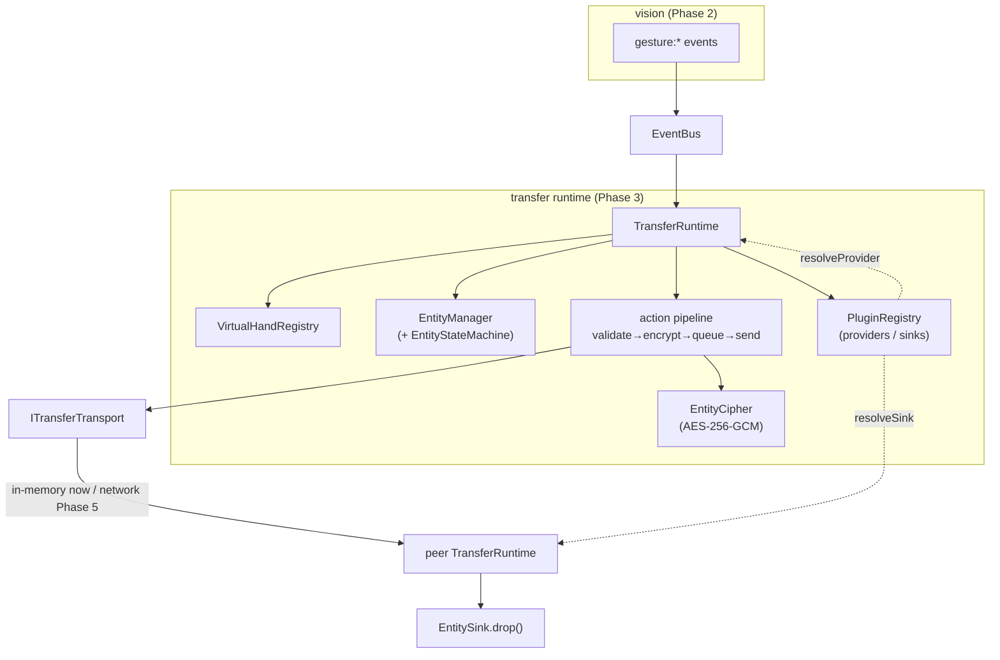
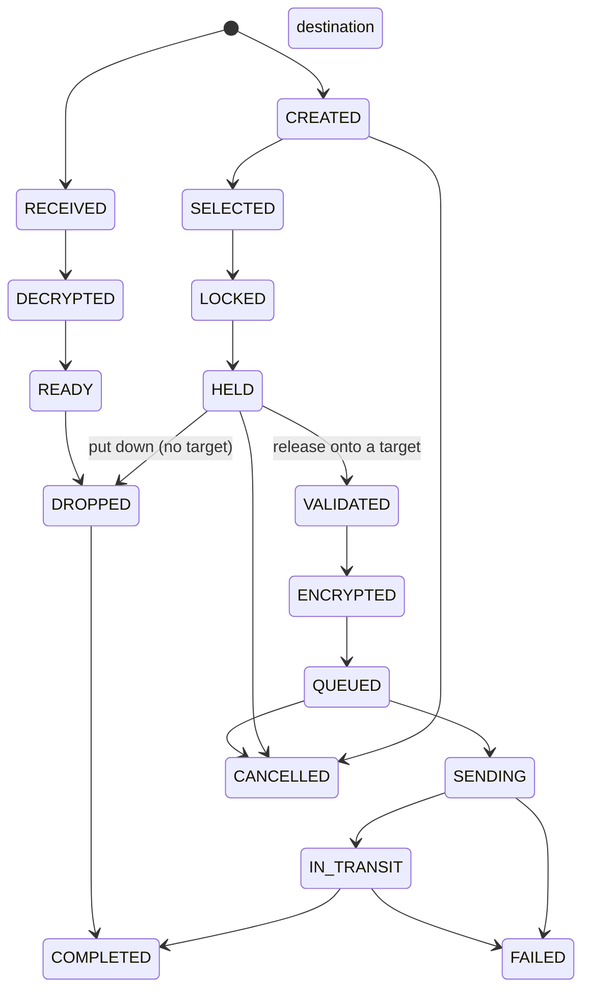

# Air Share — Phase 3: Transfer Runtime

Phase 3 turns Air Share from "gesture recognizer + network" into a **cross-device
interaction runtime**. Everything transferable — text, image, clipboard, file,
browser tab, screen region, AI selection, future plugin types — is a
`TransferableEntity` that flows through one lifecycle, one action pipeline and a
plugin system. This is the "Digital Object Runtime," not a one-off AirObject.

> Status: complete. 23 new deterministic tests (91 total). Full gesture →
> grab → encrypt → transfer → drop flow runnable in-process: `npm run transfer:demo`.

---

## The one rule that shapes everything

```
gesture → EventBus → TransferRuntime (VirtualHand) → EntityManager
        → action pipeline → ITransferTransport → (peer) → sink → drop
```

- **Vision only emits `gesture:*`** — it never calls the runtime.
- **Gestures never own entities** — the runtime owns them via `EntityManager`.
- **The network is behind `ITransferTransport`** — the runtime is transport-blind
  (Phase 5 implements it over the Phase-1 mesh; Phase 3 uses an in-memory switch).

Vision, transfer and networking are three sibling layers that all depend on
`types/` + `events/` and meet **only on the bus / behind interfaces**.

---

## Runtime architecture



### Modules (`src/transfer/`)

| File | Responsibility |
| --- | --- |
| `entityStateMachine.ts` | Table-driven legal-transition authority for the entity lifecycle. |
| `entityManager.ts` | Create / transition / (de)serialize / validate / cache / history — the only gateway that mutates entities. |
| `entityCipher.ts` | `EntityCipher` interface + `AesGcmCipher`, `NoopCipher`. |
| `registry.ts` | `EntityProvider` (produce) / `EntitySink` (consume) + priority router. |
| `virtualHand.ts` | `VirtualHandRegistry` — per-hand holding/target/entity state. |
| `targetResolver.ts` | `TargetResolver` interface + `StaticTargetResolver` (Phase 5 adds pointing). |
| `transport.ts` | `ITransferTransport` + in-memory switch/endpoints (network seam). |
| `transferRuntime.ts` | The orchestrator: gestures → hands → entities → pipeline → transport, and receive → sink. |
| `config.ts`, `index.ts` | Config + `composeTransferRuntime` DI factory. |

---

## Entity model

```ts
interface TransferableEntity<TPayload = unknown> {
  id; type: EntityType; owner; state: EntityState;
  metadata; payload: TPayload; preview?; permissions;
  encryption?; createdAt; expiresAt?;
}
```

`EntityType` spans `text · image · clipboard · file · files · folder · browser-tab
· window · video-stream · audio · screen-region · ai-selection · custom`. Concrete
providers narrow it (`TextEntity`, `ImageEntity`, `ClipboardEntity`, `FileEntity`,
…) but the runtime only ever depends on the base shape.

## Entity lifecycle (expanded state machine)



The source instance walks `CREATED→…→IN_TRANSIT→COMPLETED`; the destination
instance walks `RECEIVED→…→COMPLETED`. `FAILED` is reachable from any active
state; `CANCELLED` from any state before the point of no return.

## Action pipeline

`TransferAction` = `copy · move · stream · open · install · sync · mirror · paste
· share · cast`. On release the runtime runs: **validate → encrypt (`EntityCipher`)
→ serialize → queue → send (`ITransferTransport`) → complete**, advancing the
state machine at each step and emitting `transfer:*` events. The receive side runs
**decrypt → validate → resolve sink → drop → complete**.

## Plugins (providers & sinks)

The runtime routes entities without knowing what plugins do:

```ts
interface EntityProvider { name; types; priority?; capture(ctx): EntityDraft | undefined }
interface EntitySink     { name; types; actions; canHandle?; drop(entity, action) }
registry.register({ name: "clipboard", providers: [...], sinks: [...] });
```

- A **provider** answers "what does grabbing here produce?" (source side).
- A **sink** answers "how do I drop this here?" (destination side).

Phase 4 ships real ones (clipboard/file/image/screen/window/browser); Phase 3
defines the contracts + router and tests with mocks.

## VirtualHand

```ts
interface VirtualHand { handId; handedness; holding; entityId?; confidence; targetDeviceId?; lastGesture?; }
```

Maintained by the runtime (never by vision) from gesture events: `pinch-start`
grabs (provider → entity → `HELD` → attach), `point` aims (`TargetResolver`),
`pinch-release` sends or drops, `open-palm`/`hand-lost` cancels.

---

## Event catalogue (Phase 3 additions)

`entity:created` · `entity:state` · `entity:destroyed` · `hand:grab` ·
`hand:release` · `hand:target-changed` · `hand:updated` · `transfer:started` ·
`transfer:progress` · `transfer:received` · `transfer:completed` · `transfer:failed`.

---

## Testing strategy

Deterministic, no camera and no network:

- **State machine** — full source & destination paths, illegal-jump rejection,
  FAIL/CANCEL reachability.
- **EntityManager** — create/transition/emit, terminal retirement into
  history + recoverable cache, payload encode/serialize/decode round-trip,
  validation (transferable/size/expiry).
- **Ciphers** — Noop passthrough, AES-GCM shared-key round-trip, wrong-key &
  tamper rejection.
- **Registry** — provider fallthrough & priority, sink matching by type × action.
- **Runtime (end-to-end, loopback)** — gesture-driven grab→aim→release moves an
  encrypted entity A→B and a sink drops it; `hand:grab`/`hand:target-changed`
  fire; drop-in-place with no target; failure when no sink exists.

Run: `npm test` (91). Live: `npm run transfer:demo`, `npm run vision:demo`.

---

## Known limitations & future work (honest)

| Item | Note / future work |
| --- | --- |
| **No chunking/streaming** | Entities are sent as one serialized envelope. Large files and `stream`/`cast`/`mirror` actions need chunked, backpressure-aware transfer (Phase 4/5) — the `ITransferTransport` interface can grow a streaming method without touching the runtime. |
| **Cipher/key agreement is stubbed** | Phase 3 shares an `AesGcmCipher` key out-of-band. Phase 5 will key it from the authenticated ECDH `SecureSession` per peer; `AesGcmCipher` is reused unchanged. |
| **Target resolution is static** | `StaticTargetResolver` returns a fixed device. Phase 5 resolves the `point` ray against the `DeviceRegistry` for real "aim at that laptop" UX. |
| **No transfer approval / progress** | `transfer:progress` is defined but not emitted; large transfers should stream progress and the receiver may want to approve. |
| **Single receive handler per transport** | The in-memory transport supports one handler per device; fine for one runtime per node. |

None of these touch the vision layer or the entity/lifecycle model — they slot in
behind existing interfaces, which is the point of the runtime design.

---

## Roadmap

```
Phase 1 ✅ Networking foundation
Phase 2 ✅ Vision & Gesture Engine
Phase 3 ✅ Transfer Runtime  ← you are here
Phase 4 ⬜ Content Providers (clipboard, file, image, text, screen, window, browser)
Phase 5 ⬜ Device Actions + real transport (drop to clipboard/desktop/app/VS Code/Android;
           ITransferTransport over the Phase-1 mesh, ECDH-keyed cipher, pointing target resolver)
Phase 6 ⬜ Huawei Experience (live object animation, device highlight, beam, hover
           preview, hand-following object, audio/haptics, latency, e2e integration tests)
```

Phase 4 implements `EntityProvider`/`EntitySink`s. Phase 5 implements
`ITransferTransport` on `AirShareNode` and swaps the cipher/target resolver — the
runtime, entity model and vision layer stay unchanged.
