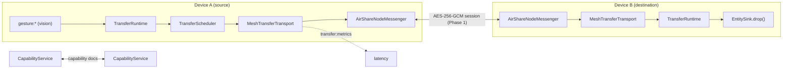

# Air Share — Phase 4: Real Device Mesh

Phase 4 proves the **entire distributed runtime** works across two real devices.
It replaces the in-memory loopback with an `ITransferTransport` that rides the
Phase-1 secure mesh, and adds the abstractions that large/live transfers will
need — a scheduler, a streaming-ready interface, capability negotiation and
latency metrics — **without changing the Transfer Runtime**.

> Status: complete. 8 new tests (99 total), including two **real `AirShareNode`s
> over WebSockets** moving a dummy entity A→B. Milestone demo: `npm run mesh:demo`
> prints `Hello from PC A` on "PC-B" with end-to-end latency.

No clipboard, no files, no UI — deliberately. Now that the mesh is proven, every
content provider in Phase 5 is a small plugin, not a networking change.

---

## Why this order (mesh before providers)

Before Phase 4 everything ran in one process (`loopback transport`). Adding
clipboard/file/screenshot providers on top of an unproven distributed path would
just create more code to debug. Phase 4 nails the hard part first:

```
PC A → gesture → grab → encrypt → NETWORK → PC B → receive → drop → "Hello from PC A"
```

---

## Architecture



The **runtime is unchanged**. It still calls `transport.send()`; the transport is
now `TransferScheduler → MeshTransferTransport` instead of the loopback. The
`mesh/` module is the only place that imports both `network` and `transfer`
(the composition seam) — vision/transfer/network still never import each other.

### New modules

| Module | Responsibility |
| --- | --- |
| `transfer/transport.ts` (extended) | Streaming-ready `ITransferTransport` (`send` + `sendStream`/`cancel`/`pause`/`resume`) and `BaseTransferTransport` (throwing `NotImplemented` defaults). |
| `transfer/scheduler.ts` | `TransferScheduler` — priority queue, bounded concurrency (congestion), retries w/ backoff, cancellation. A decorator that **is** an `ITransferTransport`. |
| `mesh/messenger.ts` | `MeshMessenger` contract + `AirShareNodeMessenger` (the only touch-point to `AirShareNode`). |
| `mesh/meshTransport.ts` | `MeshTransferTransport` — request/ack over the encrypted mesh channel, correlated by `transferId`, with timeout + latency metrics. |
| `mesh/capabilityService.ts` | `CapabilityService` — exchanges `{ device, version, supports[] }` on connect. |
| `mesh/index.ts` | `attachTransferMesh(node, opts)` — wires node → messenger → mesh transport → scheduler → runtime + capabilities. |

---

## Streaming-ready transport interface

```ts
interface ITransferTransport {
  send(envelope): Promise<TransferAck>;              // works today
  onReceive(handler): void;                          // works today
  sendStream(meta, chunks): Promise<TransferAck>;    // throws NotImplemented (for now)
  cancel(transferId): Promise<void>;                 // scheduler implements; transport: NotImplemented
  pause(transferId): Promise<void>;                  // NotImplemented (for now)
  resume(transferId): Promise<void>;                 // NotImplemented (for now)
}
```

The architecture already supports streaming/chunking/resume; only `send()` is
wired. When Phase 5/6 need 10 GB files or live screen streaming, they implement
these methods — no interface churn, no runtime change.

## TransferScheduler

Sits transparently in front of any transport:

```
TransferRuntime → TransferScheduler → MeshTransferTransport → network
```

- **Priority** — read from `entity.metadata.priority` (higher first).
- **Concurrency** — `maxConcurrent` in-flight (congestion control).
- **Retries** — failures retried with capped exponential backoff.
- **Cancellation** — `cancel(transferId)` drops queued or settles in-flight jobs.

Because it implements `ITransferTransport`, the runtime is oblivious — it just
got a smarter transport. Chunk ordering, resume and bandwidth caps have their
natural home here later.

## Latency metrics

Each transfer emits `transfer:metrics`:

| Field | Meaning | Clock-safe? |
| --- | --- | --- |
| `rttMs` | round trip: send → ack | ✅ single source clock |
| `processingMs` | dest receive → dest done | ✅ single dest clock |
| `estimatedNetworkMs` | `(rtt − processing) / 2` | ⚠️ estimate (clocks unsynced) |

Huawei feels "magical" largely because it's fast; measuring from day one lets us
optimize toward it. (Demo on loopback typically shows rtt ≈ 1–3 ms.)

## Capability negotiation

On `device:connected`, each side sends a capability doc over an encrypted channel:

```json
{ "device": "PC-B", "version": "1.0", "supports": ["transfer", "text", "files"] }
```

`capabilities.supports(deviceId, "files")` lets higher layers avoid doomed
transfers (don't offer window-capture to a phone; pick compatible clipboard
formats). Phase-1 already exchanges coarse booleans in the handshake; this adds
the richer, extensible `supports[]` the runtime reasons about.

---

## Using it

```ts
const node = new AirShareNode({ config: { deviceName: "Laptop" } });
await node.start();

const mesh = attachTransferMesh(node, {
  supports: ["transfer", "text"],
  providers: [myProvider],           // source: produce entity on grab
  sinks: [mySink],                   // destination: drop received entity
  targetResolver: new StaticTargetResolver(peerId),
});
// gesture:* events on node.events now drive real transfers to peers.
```

---

## Testing strategy

- **Scheduler** — concurrency cap, priority ordering, queued-cancel, retry-then-
  succeed (fake timers), streaming methods reject with `NotImplemented`.
- **Real mesh (2 nodes over WebSockets)** — gesture-driven dummy entity travels
  A→B through the authenticated session and a sink drops it; asserts payload,
  owner and non-negative latency metrics.
- **Capabilities** — both devices learn each other's `supports[]`.

Run: `npm test` (99). Milestone demo: `npm run mesh:demo`. Suite is stable across
repeated runs (test-cleanup made resilient to atomic-write races).

---

## Known limitations & next steps (honest)

| Item | Note / future work |
| --- | --- |
| **No chunking yet** | Entities are one message. `sendStream` is defined but `NotImplemented`; Phase 5/6 wire chunked, resumable, backpressure-aware streaming here — the scheduler is the place for ordering/resume/bandwidth. |
| **Entity cipher is Noop over the mesh** | The Phase-1 session already AES-256-GCM-encrypts the channel, so entity-level encryption is redundant on this hop and left as `Noop`. For true end-to-end (independent of relays) Phase 5 keys an `AesGcmCipher` from the `SecureSession`. |
| **Static target resolution** | `StaticTargetResolver` for now; Phase 5 resolves the `point` ray against the DeviceRegistry ("aim at that laptop"). |
| **One message per ack** | Large transfers need progress streaming (`transfer:progress` is defined, not yet emitted) and possibly receiver approval. |
| **Capabilities are advisory** | Not yet enforced (a transfer to an unsupported peer still attempts); Phase 5 can gate on `supports()`. |

None of these require touching the runtime, entity model or vision layer.

---

## Roadmap (updated order)

```
Phase 1 ✅ Networking foundation
Phase 2 ✅ Vision & Gesture Engine
Phase 3 ✅ Transfer Runtime
Phase 4 ✅ Real Device Mesh  ← you are here (distributed runtime proven)
Phase 5 ⬜ Content Providers (clipboard, image, file, text, screen, window, browser)
           — each a small plugin over the already-tested transport
Phase 6 ⬜ Huawei Experience (live object animation, device highlight, beam, hover
           preview, hand-following object, audio/haptics, latency tuning, e2e)
```

Every Phase-5 provider is now `registerProvider(...)` / `registerSink(...)` — no
networking changes required. That was the point of proving the mesh first.
