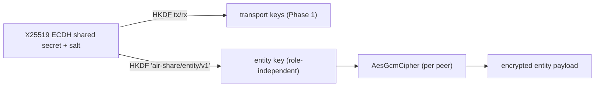

# Air Share — Phase 5A: Production Runtime

Phase 4 proved the distributed runtime works across two real devices. Before
building content providers (clipboard/files/…), Phase 5A **hardens the runtime**
so every future provider inherits a production-grade core instead of an
incomplete one. Six additive capabilities, all meeting the rest of the system
only on the EventBus / behind interfaces.

> Status: complete. 113 tests (was 99), including two real `AirShareNode`s moving
> an entity A→B under a **real session-derived AES-256-GCM key** (not Noop), with
> the transfer recorded in a ledger on both ends. Demo: `npm run mesh:demo`.

No clipboard, no files, no UI, no OS-level action execution — those are Phase 5B.

---

## 1. End-to-end entity encryption (session-derived)

The Phase-1 session already AES-256-GCM-encrypts the wire. Phase 5A also encrypts
the **object itself** with a key only the two endpoints share, so the ciphertext
stays protected even if a future transport relays it through an untrusted hop.



- The entity key is a **third HKDF output** of the same ECDH secret + salt, with a
  fixed info label — so both peers derive the **identical** key regardless of who
  initiated (`SecureSession.entityKey()`). It inherits the session's forward
  secrecy (ephemeral keys) but is namespaced away from the transport keys.
- It never leaves the connection except as this purpose-separated subkey, surfaced
  through a narrow chain: `PeerConnection.entityKey()` → `ITransport.entityKeyFor`
  → `AirShareNode.entityKeyFor` → `MeshMessenger.entityKeyFor`.
- The runtime encrypts per peer via a `CipherProvider` (`cipherFor(peerId)`):
  `SessionKeyedCipherProvider` (mesh default) keys an `AesGcmCipher` from the live
  session; `StaticCipherProvider` (used by tests/loopback) wraps one cipher.

**Honest limits:** the entity key is derived from the same session, so it shares
that session's forward secrecy rather than adding an independent ratchet; and the
receiver decrypts with the sender's peer key (symmetric) — a true relay/multi-hop
topology would layer per-recipient keying on top, which this seam already allows.

## 2. Dynamic target resolver

`RegistryTargetResolver` resolves a hand's aim against the currently-connected
devices (optionally gated by a capability predicate) instead of a hard-coded id.
The mesh seam defaults to it. Projecting the `point` gesture's ray onto a spatial
device map is the documented next step — the `resolve(hand, context)` interface
already reserves the direction input; there is simply no device geometry yet.

## 3. Capability matrix

`CapabilityDoc` gains an optional `matrix: Record<string, CapabilityFeature>`
(`{ read, write, streaming, maxBytes, version }`) alongside the coarse
`supports[]`. `CapabilityService` adds `feature(id, name)` and
`can(id, name, "read"|"write"|"streaming")`, falling back to `supports[]` when a
peer advertised no matrix. Still **advisory** this phase (not enforced).

## 4. Transfer ledger

`TransferLedger` is a pure EventBus consumer: it correlates `transfer:started`,
`transfer:retry`, `transfer:metrics`, `transfer:received`, `transfer:completed`
and `transfer:failed` by `transferId` into a bounded ring buffer of entries —
`{ source, dest, action, startedAt, completedAt, durationMs, rttMs, bytes,
retryCount, outcome }`. This is the AirDrop-style "Recent Transfers" substrate.
`recent(n)` / `all()` / `get(id)` read it back.

## 5. Transfer analytics

`ledger.analytics()` aggregates the entries: total / completed / failed / pending,
success rate, total retries, total bytes, avg duration, and avg/p50/p95 rtt.
Measuring from day one is how we tune toward "feels instant".

## 6. Action engine (registry + routing — no OS calls)

Every entity carries a `TransferAction`. Two pluggable seams formalise it:

- **Source:** `ActionResolver` decides the action a release implies.
  `DefaultActionResolver` returns the configured default, honouring a per-hand
  `action` override (for a future "move/open" modifier gesture).
- **Destination:** `ActionExecutor` is a registry — a handler registered for an
  action fully owns it; otherwise the runtime falls back to normal sink delivery
  (the unchanged default path). Handlers do **runtime routing only**; launching
  apps / running installers arrives with Phase-5B providers.

`transfer:retry` is a new event the scheduler emits per retry, feeding the ledger.

---

## What stayed the same

The Transfer Runtime's *shape* is unchanged except that its single `cipher`
became a per-peer `cipherProvider`. Vision, transfer and network still import
nothing from each other; `mesh/` remains the only composition seam. Every
existing test passed unmodified except the two that were *extended* to assert the
new E2E encryption, ledger and capability-matrix behaviour.

## Testing

- **Unit:** session entity-key (identical on both peers, separated from transport
  keys, differs for a stranger); ledger lifecycle + analytics + ring-buffer bound;
  action resolver/executor; registry target resolver; static cipher provider.
- **Integration (2 real nodes):** the Phase-4 A→B transfer now runs under the
  default session-keyed cipher and asserts the on-wire algorithm is
  `aes-256-gcm`, that both ledgers hold a `completed` entry (source with rtt,
  dest attributed to the sender), and that a structured capability matrix is
  negotiated.

Run `npm test` (113). Demo `npm run mesh:demo` prints the E2E algorithm and a
ledger summary line.

---

## Roadmap

```
Phase 1  ✅ Networking foundation
Phase 2  ✅ Vision & Gesture Engine
Phase 3  ✅ Transfer Runtime
Phase 4  ✅ Real Device Mesh
Phase 5A ✅ Production Runtime  ← you are here
Phase 5B ⬜ Content Providers (clipboard, image, file, text, screen, window, browser)
Phase 6  ⬜ Huawei Experience (floating object, beam, device highlight, haptics, e2e)
```
